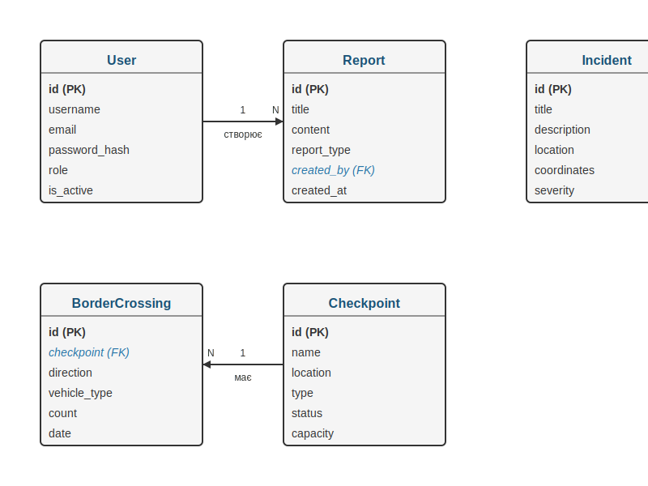

# Інструкція користувача інформаційно-аналітичної системи Національної гвардії України

## Зміст

1. [Загальний опис системи](#загальний-опис-системи)
2. [Авторизація в системі](#авторизація-в-системі)
3. [Головний дашборд](#головний-дашборд)
4. [Робота зі статистикою](#робота-зі-статистикою)
5. [Аналітичні інструменти](#аналітичні-інструменти)
6. [Управління інцидентами](#управління-інцидентами)
7. [Прогнозування](#прогнозування)
8. [Генерація звітів](#генерація-звітів)
9. [Налаштування системи](#налаштування-системи)
10. [ER-діаграма бази даних](#er-діаграма-бази-даних)

## Загальний опис системи

Інформаційно-аналітична система Національної гвардії України (ІАС НГУ) призначена для автоматизації процесів збору, обробки, аналізу та візуалізації даних про ситуацію з громадською безпекою. Система забезпечує підтримку прийняття рішень на основі аналітичних даних та прогнозів, отриманих за допомогою моделей машинного навчання.

Основні функціональні можливості системи:
- Візуалізація оперативної обстановки в зонах відповідальності НГУ
- Аналіз потенційних загроз та правопорушень
- Управління ресурсами підрозділів НГУ
- Прогнозування інцидентів та правопорушень
- Моніторинг об'єктів під охороною
- Генерація аналітичних звітів

## Авторизація в системі

### Вхід в систему

1. Відкрийте веб-браузер та перейдіть за адресою: http://localhost:5000
2. На сторінці авторизації введіть свої облікові дані:
   - Логін (ім'я користувача)
   - Пароль
3. Натисніть кнопку "Увійти"

### Відновлення паролю

1. На сторінці авторизації натисніть посилання "Забули пароль?"
2. Введіть електронну пошту, пов'язану з вашим обліковим записом
3. Натисніть кнопку "Відновити пароль"
4. Перевірте електронну пошту та дотримуйтесь інструкцій у листі для встановлення нового паролю

### Рівні доступу

Система має три рівні доступу:

1. **Адміністратор** - повний доступ до всіх функцій системи, включаючи управління користувачами та налаштування системи
2. **Аналітик** - доступ до аналітичних інструментів, прогнозування та генерації звітів
3. **Оператор** - базовий доступ для перегляду даних та реєстрації інцидентів

## Головний дашборд

Головний дашборд є основним інтерфейсом системи та надає загальний огляд поточної ситуації з громадською безпекою.

### Навігація по системі

Навігаційне меню розташоване у лівій частині екрану та містить наступні розділи:
- Головна (дашборд)
- Статистика
- Аналітика
- Інциденти
- Прогнози
- Звіти
- Налаштування

### Елементи головного дашборду

1. **Карта об'єктів НГУ** - інтерактивна карта з відображенням підрозділів та інцидентів
2. **Панель статистики** - ключові показники за поточний день/тиждень/місяць
3. **Графік активності** - динаміка правопорушень та інцидентів
4. **Список останніх інцидентів** - таблиця з останніми зареєстрованими інцидентами
5. **Прогноз загроз** - індикатор рівня загрози на найближчий період

### Інтерактивна карта

Карта дозволяє:
1. Масштабувати та переміщувати зображення за допомогою миші
2. Вибирати об'єкти НГУ для перегляду детальної інформації
3. Переглядати інциденти, позначені маркерами різних кольорів залежно від типу та статусу
4. Фільтрувати відображення за типом об'єктів та часовим періодом

## Робота зі статистикою

Розділ "Статистика" надає детальну інформацію про правопорушення та інциденти за різні періоди часу.

### Перегляд статистики правопорушень

1. Перейдіть до розділу "Статистика" через навігаційне меню
2. Виберіть вкладку "Правопорушення"
3. Налаштуйте параметри відображення:
   - Часовий період (день, тиждень, місяць, рік або довільний період)
   - Підрозділ НГУ (всі або конкретний)
   - Тип правопорушення
   - Місце скоєння
4. Натисніть кнопку "Застосувати фільтри"

### Аналіз інцидентів

1. Перейдіть до розділу "Статистика" через навігаційне меню
2. Виберіть вкладку "Інциденти"
3. Налаштуйте параметри відображення:
   - Часовий період
   - Тип інциденту
   - Статус інциденту
   - Рівень загрози
4. Натисніть кнопку "Застосувати фільтри"

### Експорт статистичних даних

1. Налаштуйте необхідні параметри відображення статистики
2. Натисніть кнопку "Експорт" у правому верхньому куті
3. Виберіть формат експорту (CSV, Excel, PDF)
4. Натисніть кнопку "Завантажити"

## Аналітичні інструменти

Розділ "Аналітика" містить інструменти для глибокого аналізу даних та виявлення трендів і закономірностей.

### Аналіз трендів

1. Перейдіть до розділу "Аналітика" через навігаційне меню
2. Виберіть вкладку "Тренди"
3. Налаштуйте параметри аналізу:
   - Тип даних (перетини кордону, інциденти)
   - Часовий період
   - Додаткові фільтри
4. Натисніть кнопку "Аналізувати"

### Порівняльний аналіз

1. Перейдіть до розділу "Аналітика" через навігаційне меню
2. Виберіть вкладку "Порівняння"
3. Виберіть два або більше періоди для порівняння
4. Налаштуйте параметри порівняння
5. Натисніть кнопку "Порівняти"

### Кореляційний аналіз

1. Перейдіть до розділу "Аналітика" через навігаційне меню
2. Виберіть вкладку "Кореляції"
3. Виберіть параметри для аналізу кореляцій
4. Натисніть кнопку "Аналізувати"

## Управління інцидентами

Розділ "Інциденти" дозволяє реєструвати, переглядати та управляти інцидентами на кордоні.

### Перегляд списку інцидентів

1. Перейдіть до розділу "Інциденти" через навігаційне меню
2. За замовчуванням відображаються всі активні інциденти
3. Використовуйте фільтри для пошуку конкретних інцидентів:
   - Статус (активний, вирішений, архівований)
   - Тип інциденту
   - Рівень загрози
   - Дата
   - Локація

### Реєстрація нового інциденту

1. Перейдіть до розділу "Інциденти" через навігаційне меню
2. Натисніть кнопку "Новий інцидент"
3. Заповніть форму реєстрації інциденту:
   - Назва інциденту
   - Опис
   - Тип інциденту
   - Рівень загрози
   - Локація (вручну або вибір на карті)
   - Додаткова інформація
4. Натисніть кнопку "Зареєструвати"

### Редагування інциденту

1. Знайдіть потрібний інцидент у списку
2. Натисніть на інцидент для перегляду детальної інформації
3. Натисніть кнопку "Редагувати"
4. Внесіть необхідні зміни
5. Натисніть кнопку "Зберегти"

### Зміна статусу інциденту

1. Знайдіть потрібний інцидент у списку
2. Натисніть на інцидент для перегляду детальної інформації
3. Натисніть кнопку "Змінити статус"
4. Виберіть новий статус (активний, вирішений, архівований)
5. За необхідності додайте коментар
6. Натисніть кнопку "Підтвердити"

## Прогнозування

Розділ "Прогнози" надає доступ до інструментів прогнозування на основі моделей машинного навчання.

### Прогнозування інцидентів

1. Перейдіть до розділу "Прогнози" через навігаційне меню
2. Виберіть вкладку "Прогноз інцидентів"
3. Налаштуйте параметри прогнозування:
   - Часовий горизонт (24 години, тиждень, місяць)
   - Регіон
   - Тип інциденту
4. Натисніть кнопку "Сформувати прогноз"

### Прогнозування перетинів кордону

1. Перейдіть до розділу "Прогнози" через навігаційне меню
2. Виберіть вкладку "Прогноз перетинів"
3. Налаштуйте параметри прогнозування:
   - Часовий горизонт
   - Пункт пропуску
   - Напрямок
   - Тип транспорту
4. Натисніть кнопку "Сформувати прогноз"

### Інтерпретація результатів прогнозування

Результати прогнозування відображаються у вигляді:
1. Графіків з прогнозованими значеннями та довірчими інтервалами
2. Таблиць з числовими значеннями
3. Карти з візуалізацією прогнозованих "гарячих точок"
4. Текстових рекомендацій щодо можливих дій

## Генерація звітів

Розділ "Звіти" дозволяє створювати, переглядати та експортувати різні типи звітів.

### Створення нового звіту

1. Перейдіть до розділу "Звіти" через навігаційне меню
2. Натисніть кнопку "Новий звіт"
3. Виберіть тип звіту:
   - Щоденний звіт
   - Тижневий звіт
   - Місячний звіт
   - Спеціальний звіт
4. Налаштуйте параметри звіту:
   - Часовий період
   - Регіони
   - Типи даних для включення
5. Натисніть кнопку "Сформувати звіт"

### Перегляд та експорт звітів

1. Перейдіть до розділу "Звіти" через навігаційне меню
2. Знайдіть потрібний звіт у списку
3. Натисніть на звіт для перегляду
4. Для експорту натисніть кнопку "Експорт" та виберіть формат (PDF, Word, Excel)

### Планування автоматичної генерації звітів

1. Перейдіть до розділу "Звіти" через навігаційне меню
2. Виберіть вкладку "Планування"
3. Натисніть кнопку "Додати розклад"
4. Налаштуйте параметри:
   - Тип звіту
   - Періодичність (щодня, щотижня, щомісяця)
   - Час генерації
   - Отримувачі (електронні адреси)
5. Натисніть кнопку "Зберегти"

## Налаштування системи

Розділ "Налаштування" доступний лише для користувачів з правами адміністратора та дозволяє конфігурувати різні аспекти системи.

### Управління користувачами

1. Перейдіть до розділу "Налаштування" через навігаційне меню
2. Виберіть вкладку "Користувачі"
3. Для створення нового користувача натисніть кнопку "Додати користувача"
4. Для редагування існуючого користувача натисніть на його ім'я у списку

### Налаштування системних параметрів

1. Перейдіть до розділу "Налаштування" через навігаційне меню
2. Виберіть вкладку "Система"
3. Налаштуйте параметри:
   - Частота оновлення даних
   - Параметри резервного копіювання
   - Налаштування сповіщень
4. Натисніть кнопку "Зберегти"

### Журнал системних подій

1. Перейдіть до розділу "Налаштування" через навігаційне меню
2. Виберіть вкладку "Журнал"
3. Перегляньте список системних подій з можливістю фільтрації за типом, датою та користувачем

## ER-діаграма бази даних

Нижче представлена ER-діаграма (Entity-Relationship) бази даних інформаційно-аналітичної системи ДПСУ, яка відображає основні сутності та зв'язки між ними.



Також діаграму можна представити у текстовому вигляді:

```
+----------------+       +-------------------+       +----------------+
|     User       |       |      Report       |       |    Incident    |
+----------------+       +-------------------+       +----------------+
| id (PK)        |       | id (PK)           |       | id (PK)        |
| username       |       | title             |       | title          |
| email          |       | content           |       | description    |
| password_hash  |       | report_type       |       | location       |
| role           |       | created_by (FK)   |<------| coordinates    |
| is_active      |       | created_at        |       | severity       |
| created_at     |-------| updated_at        |       | status         |
| last_login     |       +-------------------+       | created_at     |
+----------------+                                   | updated_at     |
                                                    +----------------+
                                                    
+-------------------+                               +----------------+
| BorderCrossing    |                               | Checkpoint     |
+-------------------+                               +----------------+
| id (PK)           |                               | id (PK)        |
| checkpoint (FK)   |-------------------------------| name           |
| direction         |                               | location       |
| vehicle_type      |                               | type           |
| count             |                               | status         |
| date              |                               | capacity       |
| created_at        |                               | created_at     |
+-------------------+                               +----------------+
```

### Опис сутностей

1. **User (Користувач)** - зберігає інформацію про користувачів системи
   - Зв'язки: один користувач може створити багато звітів (one-to-many)

2. **Report (Звіт)** - містить аналітичні звіти та документи
   - Зв'язки: кожен звіт створюється одним користувачем (many-to-one)

3. **Incident (Інцидент)** - зберігає інформацію про інциденти на кордоні
   - Зв'язки: незалежна сутність

4. **BorderCrossing (Перетин кордону)** - містить статистику перетинів кордону
   - Зв'язки: кожен перетин відбувається через конкретний пункт пропуску (many-to-one)

5. **Checkpoint (Пункт пропуску)** - зберігає інформацію про пункти пропуску
   - Зв'язки: один пункт пропуску може мати багато перетинів (one-to-many)

### Основні зв'язки

- Користувач (User) створює Звіти (Report) - зв'язок "один-до-багатьох"
- Пункт пропуску (Checkpoint) має Перетини кордону (BorderCrossing) - зв'язок "один-до-багатьох"

Ця ER-діаграма відображає основну структуру бази даних системи та може бути використана для розуміння взаємозв'язків між різними компонентами системи.